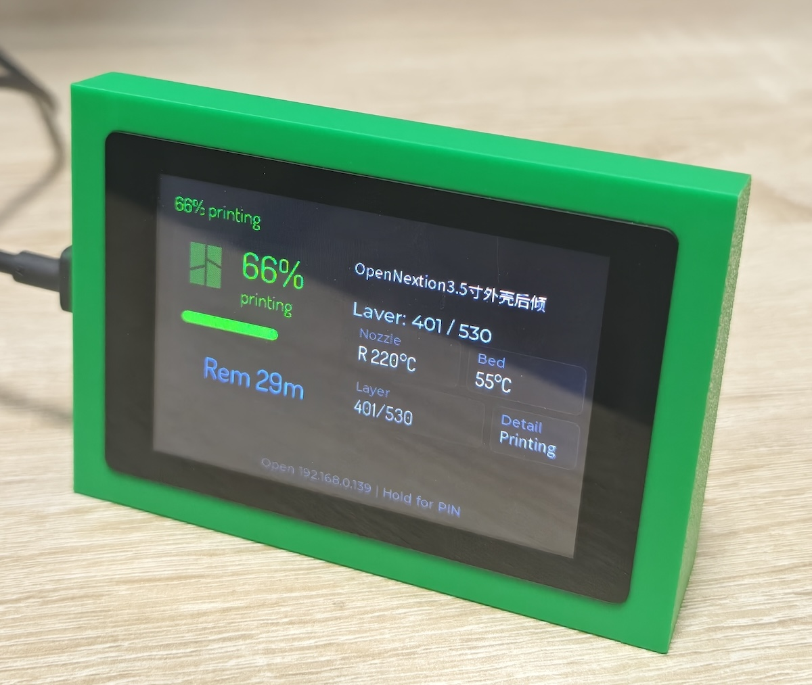
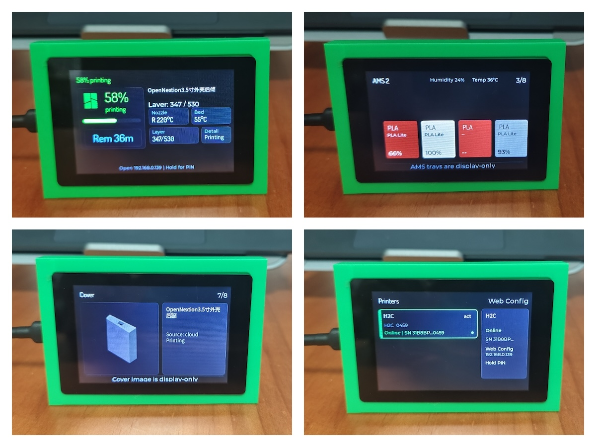

# OpenNextion-printsphere

  

OpenNextion-printsphere is a desktop status display project that ports [PrintSphere](https://github.com/cptkirki/PrintSphere) to OpenNextion ESP32 rectangular displays. It is designed to show Bambu Lab printer status, file information, AMS information, cover images, and camera snapshots.

The first adapted and tested display model is [ONX3248G035][onx3248g035].

## Background

I wanted to build a small desktop display for my Bambu Lab printer, so I could check the current print status directly from my desk. There is already an excellent project on GitHub called [PrintSphere](https://github.com/cptkirki/PrintSphere), but the original project is mainly designed for a round display.

I do not have that round display, but I do have several rectangular OpenNextion ESP32 displays, so I decided to port PrintSphere to these rectangular screens. The first completed target is [ONX3248G035][onx3248g035], which can be placed horizontally on a desk and used to show printer status, AMS information, cover images, and camera snapshots.

I chose OpenNextion displays for two reasons. First, they use ESP32 as the main controller and provide rich peripheral interfaces, which makes them useful for future DIY projects. Second, OpenNextion provides relatively complete open source and hardware resources, which makes both software porting and enclosure design easier.

For example, the [ONX3248G035][onx3248g035] resources include sample code, schematics, board-level materials, and 2D DWG plus 3D STP files. For this printer display project, no extra hardware is needed for the current version. A simple horizontal desktop stand is enough. Based on the official 3D files, I was able to quickly create a simple stand for using [ONX3248G035][onx3248g035] on my desk.

## Current Porting Work

This version is based on PrintSphere and adds OpenNextion support. The main changes are:

### 1. Added [ONX3248G035][onx3248g035] Board Support

This port adds a BSP for [ONX3248G035][onx3248g035], keeping display, touch, backlight, and LVGL initialization inside a dedicated board-level component. The public `v0.1.0` source build target is [ONX3248G035][onx3248g035] in landscape orientation.

The landscape UI has completed the main adaptation work and has been tested on real hardware. Other display models or orientations are not public `v0.1.0` build targets.

### 2. Reworked the Rectangular Landscape UI

The original project is mainly designed for a round screen. This port reorganizes the landscape UI for the rectangular [ONX3248G035][onx3248g035] display, making the main status page, AMS information, cover page, and camera page more suitable for horizontal desktop viewing.

The landscape version focuses on information density, text areas, status layout, and AMS tray display, avoiding wasted space and content overflow that can happen when a round-screen UI is directly moved to a rectangular display.

### 3. Improved CN Region Bambu Cloud Certificate Compatibility

For CN region accounts and cloud resources, this port adds handling for CN region endpoints such as `api.bambulab.cn`, `bambulab.cn`, and `cn.mqtt.bambulab.com`. It also uses the matching `GlobalSign Root R3` CA certificate for CN region cloud HTTP requests, preview downloads, and related TLS connections.

This change is intended to improve compatibility with Bambu Cloud login, device list retrieval, cover image downloads, and cloud resource access in the CN region when certificate chain issues are encountered. Non-CN paths continue to use the default ESP-IDF certificate bundle.

### 4. Added a CJK Font Subset

This port adds the `onx_cjk_16` LVGL font, generated from Source Han Sans SC. It includes ASCII plus about 2,500 commonly used modern Chinese characters. This font improves rendering for Chinese file names, Chinese project names, and device-side prompt text.

## Current Validation Status

### Display Validation

  

- [ONX3248G035][onx3248g035] can run OpenNextion-printsphere
- [ONX3248G035][onx3248g035] landscape mode has completed the main real-device validation
- The landscape UI can show the main printer status correctly
- Chinese file name display has been improved with the CJK font subset
- Other display models or orientations are not included as public `v0.1.0` build targets
- OTA firmware update has not yet been validated on real hardware, so the first release should use full firmware flashing first

### Printers I Have and Validation Matrix

Legend: ✅ Verified / ⚠️ Partially verified or not covered by my test setup / ❌ Failed or unavailable / ⏳ Not tested

| Printer | Connection mode | Connection / binding | Status data | AMS data | Cover image | Camera | Notes |
| --- | --- | --- | --- | --- | --- | --- | --- |
| Bambu Lab A1 mini | Local mode | ✅ Verified | ✅ Verified | ⚠️ Not covered by setup | ❌ Unavailable | ✅ Verified | My current A1 mini test setup does not include AMS; cover page is currently unavailable in local mode |
| Bambu Lab A1 mini | Hybrid mode | ⏳ Not tested | ⏳ Not tested | ⏳ Not tested | ⏳ Not tested | ⏳ Not tested | Needs separate validation |
| Bambu Lab H2C | Local mode | ⏳ Not tested | ⏳ Not tested | ⏳ Not tested | ⏳ Not tested | ⏳ Not tested | Needs separate validation |
| Bambu Lab H2C | Hybrid / cloud mode | ✅ Verified | ✅ Verified | ✅ Verified | ✅ Verified | ❌ Unavailable | Only tested with a CN region account |
| Bambu Lab P1S | Local mode | ⏳ Not tested | ⏳ Not tested | ⏳ Not tested | ⏳ Not tested | ⏳ Not tested | Needs validation for login, connection, status display, and camera behavior |
| Bambu Lab P1S | Hybrid mode | ⏳ Not tested | ⏳ Not tested | ⏳ Not tested | ⏳ Not tested | ⏳ Not tested | Needs validation for login, connection, status display, and camera behavior |

## Supported Hardware

| Model | Size | Status | Notes |
| --- | --- | --- | --- |
| [ONX3248G035][onx3248g035] | 3.5 inch | Verified | First adapted model, landscape mode recommended |
| [ONX2432G028][onx2432g028] | 2.8 inch | Planned | Planned future target, smaller and lower cost |

## Firmware Download and Flashing

The first release is planned as `v0.1.0`. After the release is published, the GitHub Releases page will provide one full initial flashing image for the released display model and orientation.

| Display model | Orientation | Firmware file | Version | Status |
| --- | --- | --- | --- | --- |
| [ONX3248G035][onx3248g035] | Landscape | `opennextion-printsphere-onx3248g035-landscape-full-v0.1.0.bin` | `v0.1.0` | Ready for GitHub Release upload |

For the first release, full firmware flashing is recommended. OTA update flow has not yet been validated on real hardware, so OTA firmware downloads are not provided for the first release.

Portrait firmware for [ONX3248G035][onx3248g035] and firmware for [ONX2432G028][onx2432g028] would require separate public build profiles and release validation, so they are not `v0.1.0` release assets.

## Roadmap

Planned next steps:

- Plan future landscape and portrait support for [ONX2432G028][onx2432g028]
- Investigate the unavailable camera page on Bambu Lab H2C in hybrid / cloud mode
- Validate Bambu Lab A1 mini in hybrid mode, including connection, status, AMS, cover image, and camera behavior
- Validate Bambu Lab H2C in local mode, including connection, status, AMS, cover image, and camera behavior
- Validate Bambu Lab P1S in local mode and hybrid mode, including login, connection, status display, AMS, cover image, and camera behavior

## Credits

This project is based on PrintSphere. Thanks to the original author and the related open source projects.

- PrintSphere: https://github.com/cptkirki/PrintSphere
- OpenNextion open source projects: https://github.com/OpenNextion

## License

OpenNextion-printsphere is a non-commercial derivative of [PrintSphere](https://github.com/cptkirki/PrintSphere). It preserves the original project's copyright and root license terms.

This project as a whole is licensed under the `Federation Non-Commercial License (FNCL) v1.1`. You may use, copy, modify, and share it for non-commercial purposes. Any commercial use requires separate written commercial permission from the original copyright holder.

Firmware files published in GitHub Releases are also subject to the FNCL v1.1 non-commercial restriction. Third-party components or fonts may have their own license notices; see `NOTICE.md`.

## Disclaimer

This project is not an official Bambu Lab project, not an official OpenNextion project, and not the official original PrintSphere project.

Flashing and using third-party firmware involves risk. Please use it only after understanding the risks. This project is not responsible for device damage, data loss, interrupted prints, network connection issues, or any other consequences of use.

[onx3248g035]: https://nextion.tech/wiki/onx3248g035/
[onx2432g028]: https://nextion.tech/wiki/onx2432g028/
