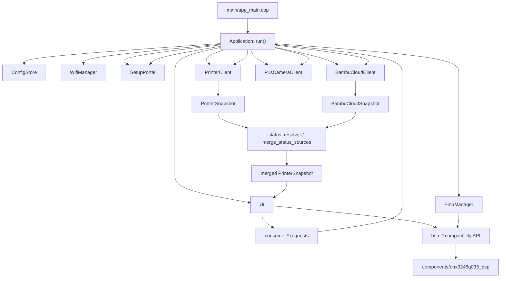

# PrintSphere ONX Porting Architecture Boundaries

This document defines the code ownership and coupling boundaries for porting
PrintSphere to ONX3248G035 without rewriting the whole application.

## Goal

Keep the upstream PrintSphere application model running on ESP-IDF/LVGL, and
replace only the board-specific and layout-specific parts needed by
ONX3248G035.

The port must not become a broad refactor of Bambu protocol, cloud/local status
merge, Web Config, OTA, or configuration storage.

## Current Architecture

Key point: `Application` owns business orchestration. `Ui` renders
`PrinterSnapshot` and emits request flags. The port should preserve this
direction of dependency.

## Coupling Points Found

### Board Selection

- Root `CMakeLists.txt` selects one board profile through `PRINTSPHERE_BOARD`.
- `main/CMakeLists.txt` maps the selected profile to exactly one BSP component.
- ONX currently uses `components/onx3248g035_bsp`.
- The ONX BSP component exposes a compatibility include path:
  `bsp/esp32_s3_touch_amoled_1_75.h`.

Constraint:

- Do not link both Waveshare and ONX BSP implementations in one firmware.
- Do not add scattered hardware conditionals across application code when a
  BSP/profile boundary can handle the difference.

### Hardware API Coupling

The main app currently uses the Waveshare-shaped BSP API:

- `bsp_display_start_with_config()`
- `bsp_display_rotation_set()`
- `bsp_display_lock()`
- `bsp_display_unlock()`
- `bsp_display_brightness_set()`
- `bsp_i2c_init()`
- `bsp_i2c_get_handle()`
- `BSP_LCD_TOUCH_INT`

ONX already maps these through `components/onx3248g035_bsp`.

Constraint:

- UI/app code should continue calling the compatibility API unless a main-thread
  accepted interface replacement is documented first.
- ST7796 display init, CST826 touch, PCF8574, and backlight details remain in
  the ONX BSP component.

### Display Size and UI Coupling

`main/src/ui.cpp` is the largest porting surface. It currently contains both:

- Stable interaction semantics: page availability, pager, brightness gesture,
  long-press PIN, printer-card switching, chamber-light toggle, remaining/ETA
  toggle, camera refresh request.
- 466 x 466 circular-layout implementation details: ring/arc widgets,
  centered labels, circular offsets, and many absolute positions.

`main/include/printsphere/board_config.hpp` still contains Waveshare constants:

- `kDisplayWidth = 466`
- `kDisplayHeight = 466`
- Waveshare I2C/touch/QSPI/AXP constants

Constraint:

- Keep the `Ui` public API stable.
- Keep the request/consume model stable.
- Replace or profile-gate the display dimension constants before building the
  320 x 480 UI.
- Rework `Ui` internals for ONX layout, but do not rewrite `Application`.

### Power / PMU Coupling

`PmuManager` is already profile-gated:

- Waveshare uses AXP2101 through XPowersLib.
- ONX currently returns `PowerSnapshot{}` and logs that PMU is unavailable.

Constraint:

- Do not probe AXP2101 on ONX.
- Battery ADC and charge-status support are separate hardware tasks, not a
  blocker for the first UI demo.

### Data Model Coupling

The central UI data contract is `PrinterSnapshot`.

Stable sources:

- `PrinterClient` for local MQTT/status.
- `BambuCloudClient` for cloud status, preview, and cloud commands.
- `status_resolver` for lifecycle/detail/status merge.
- `Application::run()` for camera, portal, power, and source-mode decisions.

Constraint:

- UI implementation threads must not add printer protocol fields just because a
  new layout wants extra text.
- If a display field is missing, mark it as unavailable or report it to the main
  thread. Do not invent protocol/state fields.

## Modules That Should Stay Stable

These modules are not expected to change for the ONX UI port:

| Module | Reason |
|---|---|
| `main/src/printer_client.cpp` | Bambu local protocol and MQTT path are board-independent. |
| `main/src/bambu_cloud_client.cpp` | Cloud protocol and preview fetching are board-independent. |
| `main/src/bambu_status.cpp` | Status parsing is board-independent. |
| `main/src/status_resolver.cpp` | Merge semantics should stay stable; UI consumes resolved data. |
| `main/src/config_store.cpp` | NVS/config schema is board-independent for demo scope. |
| `main/src/wifi_manager.cpp` | Wi-Fi provisioning and STA/AP behavior are board-independent. |
| `main/src/setup_portal.cpp` | Web Config remains the same entry point; UI only requests PIN. |
| `main/src/p1s_camera_client.cpp` | Network camera client is not a board camera driver. |
| `main/src/error_lookup.cpp` | Embedded HMS/error lookup is board-independent. |
| `main/app_main.cpp` | App bootstrap already delegates to `Application`. |

Exceptions require main-thread approval and a short explanation of why the UI or
BSP boundary cannot solve the issue.

## Modules Expected To Change

| Area | Files | Allowed change |
|---|---|---|
| Board display/touch/backlight compatibility | `components/onx3248g035_bsp/**` | Fix ONX ST7796/CST826/backlight/LVGL adapter behavior while preserving verified hardware config. |
| Board dimensions/profile constants | `main/include/printsphere/board_config.hpp` or a replacement profile header | Make dimensions board-aware: Waveshare `466 x 466`, ONX `320 x 480`. Remove hidden Waveshare-only assumptions from ONX builds. |
| UI layout construction | `main/src/ui.cpp`, `main/include/printsphere/ui.hpp` only if needed | Rebuild ONX page layout according to `docs/UI_DESIGN_SPEC.md`; keep public API and request semantics. |
| UI rendering helpers | `main/src/ui.cpp` | Adapt text fitting, preview/camera sizing, AMS page layout, and overlay placement for 320 x 480. |
| PMU fallback / later battery support | `main/src/pmu.cpp`, `components/onx3248g035_bsp/**` | Keep no-PMU demo fallback now; add ADC/charge state later as separate task. |
| Build profile docs | `docs/BUILD_FLASH.md`, `docs/DEV_ENV.md`, `docs/THREADS.md` | Update only when standard flow changes. |

## UI Porting Rules

The UI development thread must follow `docs/UI_DESIGN_SPEC.md`.

Allowed:

- Replace the circular status arc with the approved rectangular dashboard.
- Move existing labels and widgets to ONX coordinates.
- Create new LVGL containers/styles needed to match the approved layout.
- Keep existing fonts and embedded Bambu image where practical.
- Preserve interaction handlers and request flags.

Not allowed:

- Add new printer control buttons.
- Add AMS load/unload/select actions.
- Add a new settings page.
- Change Bambu protocol parsing.
- Change cloud/local merge semantics.
- Change Web Config/PIN semantics.
- Patch hardware orientation in UI code if the issue belongs to BSP.

## Recommended Implementation Slices

### Slice 1 - Board-Aware UI Dimensions

Owner: UI implementation thread, reviewed by main thread.

Tasks:

- Replace hardcoded `board::kDisplayWidth/Height` ONX values with a
  board-aware source.
- Ensure ONX builds use `320 x 480` and Waveshare builds still compile with
  `466 x 466`.
- Do not change UI visuals yet beyond dimension plumbing.

Acceptance:

- ONX build compiles.
- No app/protocol files changed.
- Diff is limited to profile constants and minimal UI size plumbing.

### Slice 2 - ONX Page Skeleton

Owner: UI implementation thread.

Tasks:

- Rebuild page containers for:
  `Printer Select -> AMS 1..4 -> Main -> Cover -> Camera`.
- Preserve existing page indices and page availability methods.
- Use the approved topbar/content/bottom-hint geometry.

Acceptance:

- Firmware boots to an ONX LVGL page.
- Pager still skips disabled pages.
- No printer protocol changes.

### Slice 3 - Main Status Rendering

Owner: UI implementation thread.

Tasks:

- Render progress, lifecycle, job/detail, temperatures, layer, battery, and
  remaining/ETA row using existing `PrinterSnapshot` fields.
- Keep logo click and remaining/ETA click behavior.

Acceptance:

- No overlapping text in common idle/printing/paused/error states.
- `consume_chamber_light_toggle_request()` and remaining/ETA toggle still work.

### Slice 4 - AMS, Cover, Camera Pages

Owner: UI implementation thread.

Tasks:

- Re-layout AMS trays as display-only cards.
- Re-layout cover image and camera image for 320 x 480.
- Keep camera tap refresh and cover no-op behavior.

Acceptance:

- AMS tray clicks are no-op.
- Cover click is no-op.
- Camera tap refresh request still works.

### Slice 5 - Overlay and Gesture Verification

Owner: UI implementation thread with hardware validation by the relevant
developer thread.

Tasks:

- Verify screen wake, horizontal pager, vertical brightness, long-press PIN,
  camera tap, logo tap, and no-op zones.
- Tune thresholds only if ONX touch noise requires it, and record the change.

Acceptance:

- All interaction acceptance cases in `docs/UI_DESIGN_SPEC.md` pass or have a
  documented blocker.

## Main-Thread Review Checklist

Before accepting any UI implementation diff:

- Does it keep `Application::run()` orchestration intact?
- Does it avoid changes to printer/cloud protocol modules?
- Does it preserve `Ui` public methods used by `Application`?
- Does it use `PrinterSnapshot` fields instead of inventing state?
- Does it keep hardware orientation/color fixes in BSP, not in UI layout?
- Does it follow the coordinates and interaction contract in
  `docs/UI_DESIGN_SPEC.md`?
- Does it compile with the standard ONX build flow in `docs/BUILD_FLASH.md`?

## Next Development Boundary

The next development task should start with Slice 1, not with a full UI rewrite.
That keeps the first diff small and proves the ONX profile can use the correct
screen dimensions before replacing page content.
